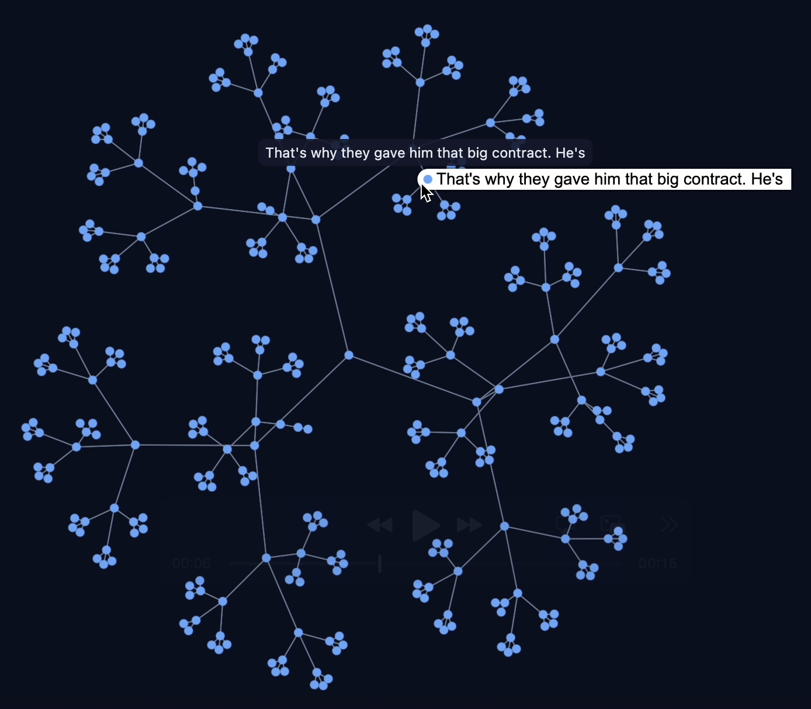

# Token Space

<p align="left">
  
</p>

A Python tool for building and visualizing token completion graphs using language models. This project creates interactive visualizations showing how language models complete text starting from a base prompt, exploring different completion paths in a graph structure.

## Features

- Build token completion graphs with configurable depth and branching
- Support for OpenAI-compatible API endpoints
- Interactive HTML visualizations using Sigma.js
- Optional word segmentation for better token boundaries
- Export completions as JSON
- Configurable retry logic for API calls

## Setup

1. Install dependencies:
```bash
uv sync
```

2. Create a `.env` file with the following required variables:
```env
BASE_URL=http://your-api-endpoint/v1
API_KEY=your-api-key
MODEL_NAME=your-model-name
GRAPH_DEPTH=3
COMPLETIONS_PER_NODE=2
MAX_RETRIES=10
```

### Environment Variables

- `BASE_URL`: The base URL for your OpenAI-compatible API endpoint
- `API_KEY`: Your API key for authentication
- `MODEL_NAME`: The name of the model to use for completions
- `GRAPH_DEPTH`: How many levels deep to build the completion graph
- `COMPLETIONS_PER_NODE`: Number of different completions to generate per node
- `MAX_RETRIES`: Maximum number of API retry attempts per completion

## Usage

Run the main script:
```bash
uv run main.py
```

The script will prompt you for:
- Base node string (the starting prompt)
- Whether to save completions as JSON
- Whether to use word segmentation
- Path to save the HTML visualization

The tool will generate an interactive HTML file that you can open in your browser to explore the token completion graph.

## Project Structure

- `main.py`: Entry point and configuration
- `src/tokens.py`: Core graph building logic
- `src/types.py`: Data structures (TokenNode, TokenNodeQueue)
- `src/viz_v2.py`: HTML visualization generation
- `src/saving.py`: JSON export functionality